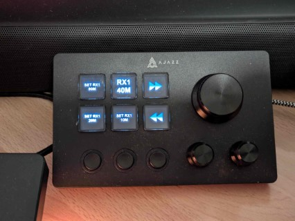

# StreamDock.Plugins.Olliter

I tested this plugin with the Ajazz AKP03 keypad, but it should work with other clones.




This is a fork from the original project which I used to reverse engineer how the StreamDock AKP03 plugins work.

I finally managed to create a plugin for the Olliter OL-Master software. The plugin is still in development and I'm working on it in my free time. Collaborations are welcome.

## Compatible devices

- Ajazz AKP03 (personally tested)
  - [Aliexpress affiliate link](https://s.click.aliexpress.com/e/_ookMI9n)
- Stream Deck MK.2 (reported by some users)
  - [Amazon affiliate link](https://www.amazon.it/dp/B09738CV2G?tag=gz-blog-21&linkCode=ogi&th=1&psc=1&ascsubtag=0-f-n-av_iu2frl)

## Olliter OL-Master plugin

This plugin is used to control the OL-Master software with macros and useful features

### Features

- [x] Main/sub receivers enable
- [x] Main/sub receivers MOX
- [x] Main/sub receivers volume (with both dials and buttons)
- [x] Main/sub receivers tuning (with both dials and buttons)
- [x] Customizable MQTT settings
- [x] OL-Master software startup
- [x] Assign icon to "Launch OL-Master" action
- [ ] Implement OL-Master software path
- [x] Implement CW Keyer macros
- [ ] Implement audio macros

### Installation

1. Download the latest release from the [releases page](https://github.com/iu2frl/StreamDock.Plugins.MqttWs/releases)
2. Double-click the `.streamDeckPlugin` file to install it on your Stream Deck software
3. The plugin should appear in your actions list under the "IU2FRL MQTT" category

For other clones (like the Ajazz AKP03 keypad), a manual installation is required:

1. Downlaod the latest release from the [releases page](https://github.com/iu2frl/StreamDock.Plugins.MqttWs/releases)
    - Select the `-manual.zip` file
2. Unzip the file to the software's plugin folder: `%appdata%\HotSpot\StreamDock\Plugins\it.iu2frl.streamdock.olliter.sdPlugin\` (manually create the plugin folder if needed)
3. Restart the AJAZZ Stream Dock software

## License

This project is licensed under the MIT License - see the [LICENSE](LICENSE) file for details

## How this works

As there's a very few documentation available for the StreamDeck plugin system, I had to reverse-engineer a lot of the functionality. Here are my findings and some notes

### Plugin structure

```text
- MainPluginFolder.sdPlugin/
-- bin/
-- images/
-- properties_inspector/
--- property-inspector.html
--- js/
---- sdtools.common.js
-- manifest.json
```

- Every pugin has a folder which has some speficic naming convention, for example `it.iu2frl.streamdock.mqtt.sdPlugin`. The `sdPlugin` at the end is always there, I'm guessing it is required.
- The `bin` folder contains the binaries that are executed when the plugin is loaded or the keys are pressed (the .NET build output in our case)
- The `images` folder contains the images used in the plugin. These are the images shown when dropping buttons to the keys.
- The `properties_inspector` folder contains the HTML and JavaScript files for the property inspector UI. These are web pages used to configure the plugin's settings.
- The `manifest.json` file contains the plugin metadata (see below).

### Manifest file

The manifest file is used by the Ajazz app to kwnow how the plugin works, for example:

```json
{
    "SDKVersion": 2,
    "Author": "DevAny",
    "CodePath": "bin/release/StreamDock.Plugins.Payload",
    "Description": "StreamDock plugin to send MQTT commands via WS.",
    "Name": "IU2FRL MQTT over WS plugin",
    "Icon": "images/IU2FRL",
    "URL": "https://www.iu2frl.it/",
    "Version": "1.0",
    "Software": {
        "MinimumVersion": "2.9"
    },
    "OS": [
        {
            "Platform": "windows",
            "MinimumVersion": "10"
        }
    ],
    "Category": "Mqtt",
    "CategoryIcon": "images/Mqtt",
    "Actions": [
        {
            "PropertyInspectorPath": "property-inspector.html",
            "Name": "Send MQTT Message",
            "Tooltip": "Sends a message to the MQTT broker when button is pressed",
            "Controllers": [
                "Keypad"
            ],
            "UUID": "it.iu2frl.streamdock.mqtt.mqttbutton",
            "Icon": "images/Mqtt",
            "SupportedInMultiActions": true
        },
        {
            "PropertyInspectorPath": "property-inspector.html",
            "Name": "Send MQTT Message",
            "Tooltip": "Sends a message to the MQTT broker when knob is rotated",
            "Controllers": [
                "Knob"
            ],
            "UUID": "it.iu2frl.streamdock.mqtt.mqttknob",
            "Icon": "images/Mqtt",
            "SupportedInMultiActions": true
        },
        {
            "PropertyInspectorPath": "property-inspector.html",
            "Name": "Keypad Debug",
            "Tooltip": "This function only prints to the log",
            "Controllers": [
                "Keypad"
            ],
            "UUID": "it.iu2frl.streamdock.keypaddebug",
            "Icon": "images/Mqtt",
            "SupportedInMultiActions": true
        },
        {
            "PropertyInspectorPath": "property-inspector.html",
            "Name": "Dial Debug",
            "Tooltip": "This function only prints to the log",
            "Controllers": [
                "Knob"
            ],
            "UUID": "it.iu2frl.streamdock.dialdebug",
            "Icon": "images/Mqtt",
            "SupportedInMultiActions": true
        }
    ]
}
```

As you can see, there's an `Actions` array which contains a mapping to the C# methods (see below.)

#### Manifest documentation

The full documentation can be found here: [https://staging-docs.elgato.com/streamdeck/sdk/references/manifest/](https://staging-docs.elgato.com/streamdeck/sdk/references/manifest/)

#### Actions Controllers

I've found two controllers so far:

- `Keypad`: which tells the plugin this action can be used on keys
- `Knob`: which tells the plugin this action can be applied to knobs

Then, for some reason I've also found:

- `Information`: unknown (not documented in the plugins doc)

#### Automatic generation

The script called `build_manifest.py` will read the plugin source code and build the manifest file automatically.

The plugin only builds the actions list, other customization should be done manually.

### C# code

#### Keypad

The base method implementation for an action (like a key press) is derived from the `KeyPadBase` from the StreamDeck package. I preferred to wrap this initializer to a custom class so I can create shorter code when defining actions.

```csharp
namespace Common
{
    public class BaseKeyItem : KeypadBase
    {
        public BaseKeyItem(ISDConnection connection, InitialPayload payload) : base(connection, payload)
        {
            Logger.Instance.LogMessage(TracingLevel.INFO, $"{GetType().Name}: Something to do as soon as the element is initialized");
        }

        public override void KeyPressed(KeyPayload payload)
        {
            Logger.Instance.LogMessage(TracingLevel.INFO, $"{GetType().Name}: KeyPressed called");
        }

        public override void KeyReleased(KeyPayload payload)
        {
            Logger.Instance.LogMessage(TracingLevel.INFO, $"{GetType().Name}: KeyReleased called");
        }

        public override void OnTick()
        {
            // Not sure when this is called
        }

        public override void Dispose()
        {
            Logger.Instance.LogMessage(TracingLevel.INFO, $"{GetType().Name}: Something to do when the object is removed");
        }

        public override void ReceivedSettings(ReceivedSettingsPayload payload)
        {
            Logger.Instance.LogMessage(TracingLevel.INFO, $"{GetType().Name}: ReceivedSettings called");
        }

        public override void ReceivedGlobalSettings(ReceivedGlobalSettingsPayload payload)
        {
            Logger.Instance.LogMessage(TracingLevel.INFO, $"{GetType().Name}: ReceivedGlobalSettings called");
        }
    }
}
```

Once we creat that wrapper, for each action we need to define a NameSpace similar to this one:

*Please note*: The comments above the method name are used by the Python script (called `build_manifest.py`) to build the manifest file automatically at every build event of the .NET solution. They are not normally needed.

```csharp
namespace ToggleMox1
{
    // Name: MOX Receiver 1
    // Tooltip: Toggle receive/transmit RX 1
    // Controllers: Keypad
    [PluginActionId("it.iu2frl.streamdock.mqtt.togglemox1")]
    public class ToggleRx1(ISDConnection connection, InitialPayload payload) : Common.BaseKeyItem(connection, payload)
    {
        public override void KeyPressed(KeyPayload payload)
        {
            Logger.Instance.LogMessage(TracingLevel.INFO, "KeyPressed called");
        }
    }
}
```

#### Knobs

The base method implementation for an action (like a dial rotation) is derived from the `EncoderBase` from the StreamDeck package. I preferred to wrap this initializer to a custom class so I can create shorter code when defining actions.

```csharp
public class BaseDialItem : EncoderBase
{
    public BaseDialMqttItem(ISDConnection connection, InitialPayload payload) : base(connection, payload)
    {
        Logger.Instance.LogMessage(TracingLevel.INFO, $"{GetType().Name}: Something to do as soon as the element is initialized");
    }

    public override void DialDown(DialPayload payload)
    {
        Logger.Instance.LogMessage(TracingLevel.INFO, $"{GetType().Name}: DialDown called");
    }

    public override void DialRotate(DialRotatePayload payload)
    {
        Logger.Instance.LogMessage(TracingLevel.INFO, $"{GetType().Name}: DialRotate called");
    }

    public override void DialUp(DialPayload payload)
    {
        Logger.Instance.LogMessage(TracingLevel.INFO, $"{GetType().Name}: DialUp called");
    }

    public override void Dispose()
    {
        Logger.Instance.LogMessage(TracingLevel.INFO, $"{GetType().Name}: Dispose called");
    }

    public override void OnTick()
    {
        // Not sure when this is called
    }

    public override void ReceivedGlobalSettings(ReceivedGlobalSettingsPayload payload)
    {
        Logger.Instance.LogMessage(TracingLevel.INFO, $"{GetType().Name}: ReceivedGlobalSettings called");
    }

    public override void ReceivedSettings(ReceivedSettingsPayload payload)
    {
        Logger.Instance.LogMessage(TracingLevel.INFO, $"{GetType().Name}: ReceivedSettings called");
    }

    public override void TouchPress(TouchpadPressPayload payload)
    {
        Logger.Instance.LogMessage(TracingLevel.INFO, $"{GetType().Name}: TouchPress called");
    }
}
```

Once we creat that wrapper, for each action we need to define a NameSpace similar to this one:

*Please note*: The comments above the method name are used by the Python script (called `build_manifest.py`) to build the manifest file automatically at every build event of the .NET solution. They are not normally needed.

```csharp
namespace TuneRx1
{
    // Name: Tune Receiver 1
    // Tooltip: Frequency knob for RX 1
    // Controllers: Knob
    [PluginActionId("it.iu2frl.streamdock.mqtt.tunerx1")]
    public class TuneRx1(ISDConnection connection, InitialPayload payload) : Common.BaseDialMqttItem(connection, payload)
    {
        public override void DialUp(DialPayload payload)
        {
            Logger.Instance.LogMessage(TracingLevel.INFO, "Dial was rotated");
        }
    }
}
```

### Actions settings

This plugin supports a variety of actions, each with its own settings. The *StreamDock.Plugins.Olliter* plugin uses a two-tier settings system:

1. **Global Settings**: Configuration shared across all plugin instances
2. **Local Settings**: Configuration specific to each plugin instance

### Settings Architecture

The settings system operates through a bidirectional communication between:

- The C# backend (`Common.cs`)
- The JavaScript frontend (`sdtools.common.js`)

Each `property-inspector.html` file corresponds to a specific plugin instance/type and contains the UI elements for configuring that instance. The `sdtools.common.js` file handles the communication between the UI and the C# backend by reading the settings from the CS code to build the UI (like with the dropdown lists) and loading the default settings (or the previous ones).

Once some changes are detected by the UI with the `setSettings()` function, the updated settings are sent to the C# backend for processing as a JSON payload. These payloads trigger the `ReceivedSettings` or `ReceivedGlobalSettings` handlers in the plugin, which update the internal settings objects.

### Global Settings

Global settings are stored in the `GlobalPluginSettings` class and include MQTT connection details:

- MQTT Host
- MQTT Port
- Authentication credentials
- WebSocket configuration

### Local Settings

Local settings are stored in the `PluginSettings` class and include configuration specific to each plugin instance:

- Receiver index
- Sub-receiver selection
- Band selection
- Volume increments
- Frequency increments
- SDR mode

### Data Flow

1. **Initialization**:
    - When a plugin instance starts, it checks for existing settings in the payload
    - If no settings are found, default settings are created

2. **Settings Update**:
    - When settings change in the Property Inspector, `setSettings()` in `sdtools.common.js` collects values from UI elements
    - Settings are sent to the plugin via WebSocket using the `setSettings` or `setGlobalSettings` event
    - In the plugin, `ReceivedSettings` or `ReceivedGlobalSettings` handlers update the internal settings objects

3. **Settings Loading**:
    - The plugin sends settings to the Property Inspector via the `didReceiveSettings` or `didReceiveGlobalSettings` event
    - `loadConfiguration()` in `sdtools.common.js` populates UI elements with values

### JSON Property Mapping

JSON property names defined with `[JsonProperty]` in the C# classes map directly to HTML element IDs in the Property Inspector:
