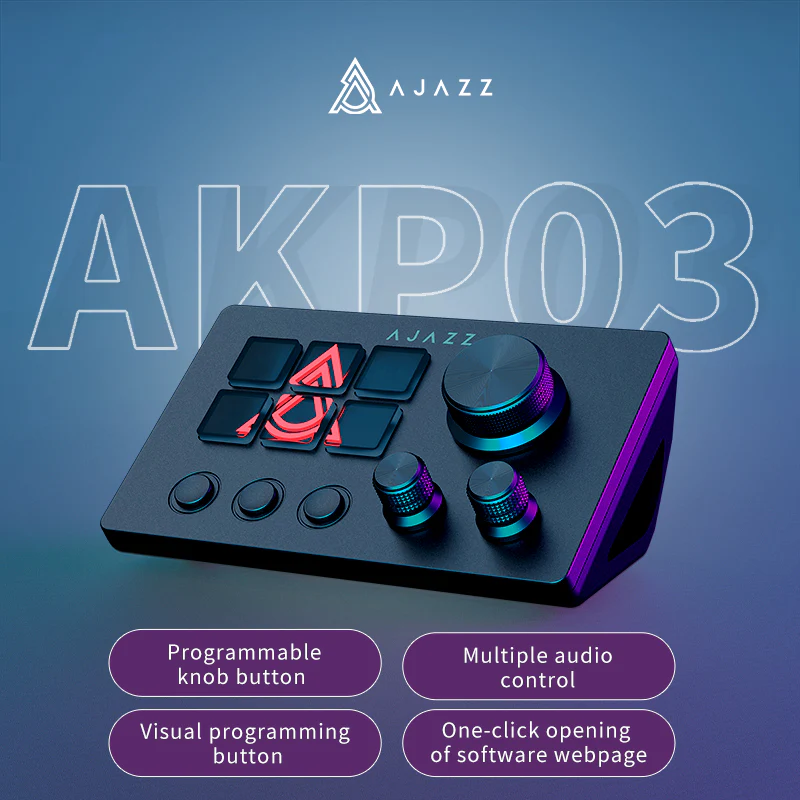

# StreamDock.Plugins.Olliter



This is a fork from the original project which I used to reverse engineer how the StreamDock AKP03 plugins work.

I am working to get it up and running to control the OL-Master application.

## Olliter OL-Master plugin

This plugin is used to control the OL-Master software with macros and useful features

### Features

- Work in progress

### How to use

1. Clone the repo
1. Compile the source code using Visual Studio (`.NET SDK` is required)
1. Copy the `it.iu2frl.streamdock.olliter` folder to `%AppData%\HotSpot\StreamDock\plugins\` and restart the Ajazz software.
1. (optional) Create a new scene.
1. Drag and drop the different actions to the buttons/knobs.
1. Configure the action if needed

## How this works

Base plugin structure:

```text
- MainPluginFolder.sdPlugin/
-- bin/
-- images/
-- manifest.json
```

- Every pugin has a folder which has some speficic naming convention, for example `it.iu2frl.streamdock.olliter.sdPlugin`. The `sdPlugin` at the end is always there, I'm guessing it is reqiured.
- The `bin` folder contains the binaries that are executed when the plugin is loaded or the keys are pressed (the .NET build output in our case)
- The `images` folder contains the images used in the plugin. These are the images shown when dropping buttons to the keys.
- The `manifest.json` file contains the plugin metadata (see below).

### Manifest file

The manifest file is used by the Ajazz app to kwnow how the plugin works, for example:

```json
{
    "SDKVersion": 2,
    "Author": "DevAny",
    "CodePath": "bin/release/StreamDock.Plugins.Payload",
    "Description": "StreamDock plugin to send commands to Olliter OL-Master software.",
    "Name": "IU2FRL OL-Master plugin",
    "Icon": "images/IU2FRL",
    "URL": "https://www.iu2frl.it/",
    "Version": "1.0",
    "Software": {
        "MinimumVersion": "2.9"
    },
    "OS": [
        {
            "Platform": "windows",
            "MinimumVersion": "10"
        }
    ],
    "Category": "Olliter",
    "CategoryIcon": "images/Olliter",
    "Actions": [
        {
            "Name": "Toggle Receiver 1",
            "Tooltip": "Toggle main power to RX 1",
            "UUID": "it.iu2frl.streamdock.olliter.togglerx1",
            "Icon": "images/Olliter",
            "Controllers": [
                "Keypad",
                "Information"
            ],
            "SupportedInMultiActions": false
        },
        {
            "Name": "MOX Receiver 1", // Name of the object in the actions list
            "Tooltip": "Toggle receive/transmit RX 1", // Shown when hovering on the action
            "UUID": "it.iu2frl.streamdock.olliter.togglemox1", // Name of the PluginActionId in C# code
            "Icon": "images/Olliter", // Name of the png file to be shown in the actions list
            "Controllers": [ // Not completely clear
                "Keypad",
                "Information"
            ],
            "SupportedInMultiActions": false // Not completely clear
        },
        {
            "Name": "Debug",
            "Tooltip": "This function only prints to the log",
            "UUID": "it.iu2frl.streamdock.debug",
            "Icon": "images/Olliter",
            "Controllers": [
                "Keypad",
                "Information"
            ],
            "SupportedInMultiActions": false
        }
    ]
}
```

As you can see, there's an `Actions` array which contains a mapping to the C# methods (see below.)

### Actions Controllers

I've found three controllers so far:

- `Keypad`: which tells the plugin this action can be used on keys
- `Information`: unknown
- A third one to identify which control can be assigned to knobs

### C# code

The base method implementation for an action (like a key press) is derived from the `KeyPadBase` from the StreamDeck package. I preferred to wrap this initializer to a custom class so I can create shorter code when defining actions.

```csharp
namespace Common
{
    public class BaseKeyItem : KeypadBase
    {
        public BaseKeyItem(ISDConnection connection, InitialPayload payload) : base(connection, payload)
        {
            Logger.Instance.LogMessage(TracingLevel.INFO, "Something to do as soon as the element is initialized");
        }

        public override void KeyPressed(KeyPayload payload)
        {
            Logger.Instance.LogMessage(TracingLevel.INFO, "KeyPressed called");
        }

        public override void KeyReleased(KeyPayload payload)
        {
            Logger.Instance.LogMessage(TracingLevel.INFO, "KeyReleased called");
        }

        public override void OnTick()
        {
            // Not sure when this is called
        }

        public override void Dispose()
        {
            Logger.Instance.LogMessage(TracingLevel.INFO, "Something to do when the object is removed");
        }

        public override void ReceivedSettings(ReceivedSettingsPayload payload)
        {
            Logger.Instance.LogMessage(TracingLevel.INFO, "ReceivedSettings called");
        }

        public override void ReceivedGlobalSettings(ReceivedGlobalSettingsPayload payload)
        {
            Logger.Instance.LogMessage(TracingLevel.INFO, "ReceivedGlobalSettings called");
        }
    }
}
```

Once we creat that wrapper, for each action we need to define a NameSpace similar to this one:

*Please note*: The comments above the method name are used by the Python script (called `build_manifest.py`) to build the manifest file automatically at every build event of the .NET solution. They are not normally needed.

```csharp
namespace ToggleMox1
{
    // Name: MOX Receiver 1
    // Tooltip: Toggle receive/transmit RX 1
    [PluginActionId("it.iu2frl.streamdock.olliter.togglemox1")]
    public class ToggleRx1(ISDConnection connection, InitialPayload payload) : Common.BaseKeyItem(connection, payload)
    {
        public override void KeyPressed(KeyPayload payload)
        {
            Logger.Instance.LogMessage(TracingLevel.INFO, "KeyPressed called");
        }
    }
}
```
