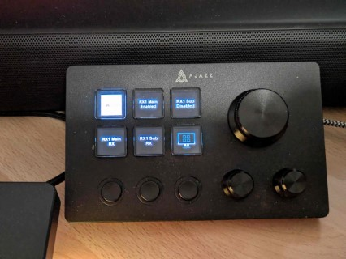

# StreamDock.Plugins.Olliter

I tested this plugin with the Ajazz AKP03 keypad, but it should work with other clones.

This is a fork from the original project which I used to reverse engineer how the StreamDock AKP03 plugins work.

I finally managed to create a plugin for the Olliter OL-Master software. The plugin is still in development and I'm working on it in my free time. Collaborations are welcome.

## Compatible devices

- Ajazz AKP03 (personally tested)
- Stream Deck MK.2 (reported by some users)

## Olliter OL-Master plugin

This plugin is used to control the OL-Master software with macros and useful features

### Features

- Main/sub receivers enable
- Main/sub receivers MOX
- Main/sub receivers volume (with both dials and buttons)
- Main/sub receivers tuning (with both dials and buttons)
- OL-Master software startup

### TODO

- [ ] Implement mode change using buttons
- [ ] Implement OL-Master software path
- [ ] Implement CW Keyer macros
- [ ] Implement audio macros

### Installation

1. Download the latest release from the [releases page](https://github.com/iu2frl/StreamDock.Plugins.MqttWs/releases)
2. Double-click the `.streamDeckPlugin` file to install it on your Stream Deck software
3. The plugin should appear in your actions list under the "IU2FRL MQTT" category

For other clones (like the Ajazz AKP03 keypad), a manual installation is required:

1. Downlaod the latest release from the [releases page](https://github.com/iu2frl/StreamDock.Plugins.MqttWs/releases)
    - Select the `-manual.zip` file
2. Unzip the file to the software's plugin folder: `%appdata%\HotSpot\StreamDock\Plugins\it.iu2frl.streamdock.olliter.sdPlugin\` (manually create the plugin folder if needed)
3. Restart the AJAZZ Stream Dock software

## License

This project is licensed under the MIT License - see the [LICENSE](LICENSE) file for details
